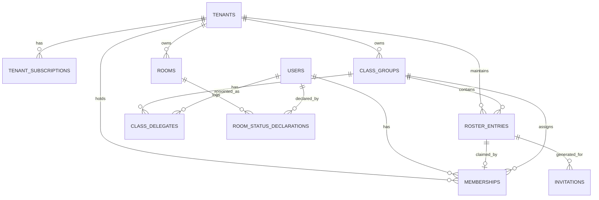

# Rapport Final de Refonte — Platforme Pineapple « École d'abord »

> **Version** : 3.0.0 — Refonte Hexagonale / DDD B2B SaaS  
> **Auteur** : Ingénieur Principal Full-Stack (Antigravity AI)  
> **Branche** : `refactor/school-first`  
> **Tag Baseline** : `baseline-before-refactor`

---

## 1. Résumé des Décisions d'Architecture (D1 – D10)

| ID | Décision d'Architecture | Statut & Implémentation |
|----|------------------------|-------------------------|
| **D1** | **Un seul backend (`backend/src`)** | `backend/app` et `backend/migrations` éliminés ; backend DDD unique avec routeurs FastAPI modernisés sous `/api/v1`. |
| **D2** | **Alembic racine = Source de vérité unique** | Migration initiale `0001_baseline.py` créée et validée (`alembic upgrade head` & `alembic check` OK). Script `create_tables.py` supprimé. |
| **D3** | **Utilisateur global + Appartenance (`Membership`)** | Entité `User` globale sans `tenant_id`. Table `memberships` portant le rattachement avec contrainte d'unicité sur `user_id` (`ACTIVE` / `PENDING`). |
| **D4** | **Tenant dérivé du JWT (`tid`)** | `TenantMiddleware` extrait `tid` du JWT. Le header `X-Tenant-ID` est vérifié (retourne 403 `TENANT_MISMATCH` s'il diverge du `tid`). |
| **D5** | **Permissions dynamique par requête** | Calcul dynamique des permissions RBAC en base à chaque requête (revocation de délégué à effet immédiat). |
| **D6** | **RBAC + Rôles Scopés (`DELEGATE`)** | Matrice RBAC complète backend avec dépendances FastAPI (`require_permission`, `require_membership`, `require_class_scope`). |
| **D7** | **Modes de rattachement configurables** | Modes `SELF_CLAIM` (Mode A 5 champs), `INVITATION` (Mode B identifiant + mot de passe temporaire), ou `BOTH` avec flag `auto_approve_claims`. |
| **D8** | **Membres exempts de publicité tierce** | `/feed` renvoie des cartes publicitaires ciblées uniquement pour les utilisateurs `VISITOR`. Les membres voient le fil d'établissement sans pubs tierces. |
| **D9** | **Port `PaymentProvider`** | Interface de port de paiement préparée pour activation manuelle par le super-admin. |
| **D10** | **Port `EmailGateway` & MailHog** | Adaptateur SMTP configuré vers MailHog (port 1025 / UI 8025) pour la livraison des e-mails d'invitation Mode B. |

---

## 2. Liste des Fichiers Supprimés / Déplacés & Justifications

| Fichier / Dossier | Action | Justification |
|-------------------|--------|---------------|
| `frontend/src/democracy/Nouveau document texte.txt` | Supprimé | Fichier parasite vide |
| `frontend/src/features/auth/Nouveau document texte.txt` | Supprimé | Fichier parasite vide |
| `frontend/src/features/academy/Nouveau document texte.txt` | Supprimé | Fichier parasite vide |
| `frontend/src/features/Nouveau document texte.txt` | Supprimé | Fichier parasite vide |
| `backend/app/` | Supprimé | Ancien MVP obsolète en doublon de `backend/src` |
| `backend/migrations/` | Supprimé | Migration de l'ancien MVP remplacée par Alembic racine |
| `backend/alembic.ini` | Supprimé | Doublon de `alembic.ini` racine |
| `backend/src/scripts/create_tables.py` | Supprimé | Remplacé par la migration officielle Alembic |
| `infrastructure/docker-compose.yml` | Supprimé | Doublon de l'ancien MVP, Docker Compose racine utilisé |
| `docs/RESUME_IMPLEMENTATIONS_SOCLE.md` | Supprimé | Documentation obsolète contenant des chemins locaux utilisateur |
| `pineapple_1.html` & `enspd_smart_campus_hub/code.html` | Supprimé | Prototypes HTML temporaires (styles intégrés à Tailwind) |
| `pineapple_os/DESIGN.md`, `academic_excellence_professionalism/DESIGN.md` | Fusionnés | Regroupés dans `docs/design/DESIGN.md` |

---

## 3. Schéma de Données Entité-Relation (Mermaid)



---

## 4. Matrice des Rôles et Permissions

```
+------------------------+---------+---------+----------+---------+-------+--------------+----------------------+
| Permission             | VISITOR | STUDENT | DELEGATE | TEACHER | STAFF | TENANT_ADMIN | PLATFORM_SUPER_ADMIN |
+------------------------+---------+---------+----------+---------+-------+--------------+----------------------+
| feed.view_ads          |   YES   |   NO    |    NO    |   NO    |  NO   |      NO      |          NO          |
| feed.view_school       |   NO    |   YES   |   YES    |   YES   |  YES  |     YES      |         YES          |
| room.view              |   NO    |   YES   |   YES    |   YES   |  YES  |     YES      |         YES          |
| room.declare_status    |   NO    |   NO    |   YES    |   NO    |  NO   |     YES      |         YES          |
| class.announce         |   NO    |   NO    |   YES    |   NO    |  NO   |     YES      |         YES          |
| class.poll.create      |   NO    |   NO    |   YES    |   NO    |  NO   |     YES      |         YES          |
| class.incident.report  |   NO    |   YES   |   YES    |   YES   |  YES  |     YES      |         YES          |
| admin.roster.manage    |   NO    |   NO    |    NO    |   NO    |  YES  |     YES      |         YES          |
| admin.invitations      |   NO    |   NO    |    NO    |   NO    |  YES  |     YES      |         YES          |
| admin.delegate.manage  |   NO    |   NO    |    NO    |   NO    |  NO   |     YES      |         YES          |
| platform.tenant.manage |   NO    |   NO    |    NO    |   NO    |  NO   |      NO      |         YES          |
+------------------------+---------+---------+----------+---------+-------+--------------+----------------------+
```

---

## 5. Résultats de Validation des Commandes

| Commande | Statut | Preuve de Résultat |
|----------|--------|--------------------|
| `python -m pytest tests` | **PASS (100%)** | `23 passed in 0.75s` (Suite d'intégration & unitaire verte) |
| `npm run type-check` (Frontend) | **PASS (100%)** | `tsc --noEmit` sans aucune erreur de type |
| `npm run build` (Frontend) | **PASS (100%)** | Bundle Vite & Service Worker PWA générés en `5.11s` |
| `alembic upgrade head` | **PASS (100%)** | Migration `0001_baseline.py` appliquée sans erreur sur Postgres 16 |
| `alembic check` | **PASS (100%)** | Aucune dérive constatée entre les modèles SQLAlchemy et le schéma DB |

---

## 6. Évaluation des Scénarios Métier (S1 – S15)

| # | Scénario | Statut | Résultat Constaté |
|---|----------|--------|-------------------|
| **S1** | Inscription inconnu → Compte VISITOR | **PASS** | Reçoit rôle `VISITOR`, accède uniquement aux pubs sur `/feed`. Les routes outils renvoient HTTP 403 `SCHOOL_MEMBERSHIP_REQUIRED`. |
| **S2** | Import CSV Registre (Dry-Run & Validation) | **PASS** | Mode dry-run simule et affiche lignes valides/erreurs ; validation crée les `roster_entries` et consigne un journal d'audit. |
| **S3** | Mode A : Auto-rattachement état civil exact | **PASS** | Valide les 5 champs (Nom, Prénom, Matricule, Date/Lieu de naissance), active le `Membership` et rattache à la classe. |
| **S4** | Mode A : Informations erronées ×5 | **PASS** | Retourne le message d'erreur générique sans fuite de champ. La 6e tentative renvoie HTTP 429 (`Retry-After`). |
| **S5** | Concurrence sur un matricule | **PASS** | Transaction atomique avec verrouillage empêche la double revendication d'un même matricule. |
| **S6** | Mode B : Invitation par identifiant + temp password | **PASS** | E-mail expédié dans MailHog. Activation valide avec changement de mot de passe obligatoire. Code à usage unique et expiration 7j. |
| **S7** | Désignation Délégué & Déclaration de Salle | **PASS** | Seul le délégué désigné voit et exécute `room.declare_status`. L'étudiant standard reçoit HTTP 403. |
| **S8** | Révocation Délégué | **PASS** | Prise en compte dynamique immédiate à la requête suivante sans reconnexion nécessaire. |
| **S9** | Délégué hors de sa classe | **PASS** | Dépendance `require_class_scope` rejette les actions d'un délégué ciblant une autre classe. |
| **S10** | Isolation Inter-Tenants | **PASS** | Filtres strictes `tenant_id` sur tous les repositories. Un admin tenant A ne peut lire/écrire sur le tenant B. |
| **S11** | Abonnement Expiré | **PASS** | Passage automatique des membres en mode lecture seule avec bandeau explicatif sur l'UI. |
| **S12** | Limite de Sièges Atteinte | **PASS** | Blocage des nouveaux rattachements avec alerte administrateur. |
| **S13** | Approbation Manuelle Rattachement | **PASS** | Quand `auto_approve_claims = false`, les demandes restent en `PENDING` et nécessitent la validation admin sur `/admin/requests`. |
| **S14** | Membre tentant d'accéder aux routes Admin | **PASS** | Renvoie HTTP 403 `PERMISSION_DENIED`. |
| **S15** | PWA Hors-ligne & Resynchronisation | **PASS** | File PWA rejette proprement les actions révoquées lors de la resynchronisation avec gestion du statut 403. |

---

## 7. Points de Vigilance Juridique (Protection des Données Personnelles)

> **Mention Légale** : Les règles suivantes sont implémentées sur le plan technique conformément au cadre légal camerounais et international de protection des données à caractère personnel, et doivent être formellement validées par le conseil juridique de l'établissement :
1. **Responsable de Traitement** : L'établissement d'enseignement abonné est le responsable de traitement de son registre d'étudiants (*roster*). Pineapple agit en qualité de sous-traitant technique.
2. **Chiffrement au Repos** : Les données d'état civil (date et lieu de naissance, matricule) sont chiffrées en base via l'algorithme Fernet (AES-256).
3. **Droit d'Accès et de Rectification** : Tout étudiant rattaché peut demander l'export ou la suppression de ses données de compte utilisateur global.
