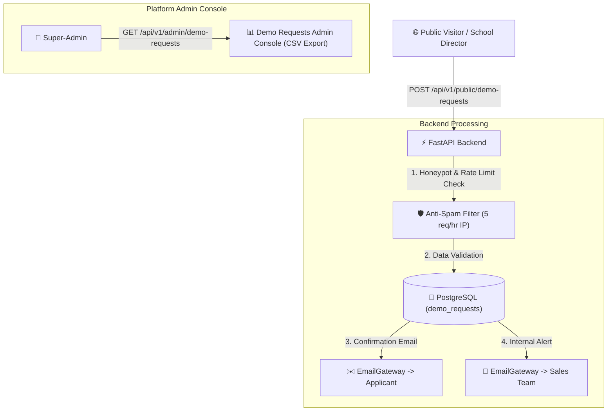

# Architecture Document — Website & Sales Kit (Pineapple OS)

**Document Ref:** `docs/website/ARCHITECTURE_WEBSITE.md`  
**Target Audience:** School Directors, General Secretaries, Academic Deans in Cameroon & Francophone Africa  
**Primary Language:** French (`/fr` or `/`), Secondary: English (`/en`)  

---

## 1. Objectives & Conversion Strategy

The public website of Pineapple OS serves as the primary acquisition channel for educational institutions:
- **Conversion Goal**: Enable a school director to understand the value proposition in $\le$ 2 minutes and request a live demonstration.
- **Zero Fake Proof Principle (Rule V3)**: Absolute prohibition of fake testimonials, fake logos, or fabricated metrics. Placeholder tags (`PLACEHOLDER_SOCIAL_PROOF`) are hidden in production until populated with real verified client data.
- **Local Channel Optimization**: Prominent WhatsApp direct contact button (`wa.me`) alongside the formal demo request form.

---

## 2. Technical Stack & Directory Layout (`website/`)

- **Framework**: Astro (Static Site Generation for sub-second load times and zero unnecessary JS).
- **Styling**: TailwindCSS (matching Pineapple OS design system in `docs/design/DESIGN.md`).
- **SEO & Performance**: 
  - Sub-resource preloading, WebP/AVIF responsive images.
  - Lighthouse score target $\ge 95$ across Performance, SEO, Accessibility, and Best Practices.
  - Privacy-first cookie-less analytics (Plausible / Umami).

### File Structure
```text
website/
├── public/
│   ├── favicon.ico
│   ├── robots.txt
│   ├── sitemap.xml
│   └── images/
├── src/
│   ├── components/
│   │   ├── Header.astro
│   │   ├── Footer.astro
│   │   ├── DemoRequestForm.astro
│   │   ├── WhatsAppButton.astro
│   │   ├── PricingCard.astro
│   │   └── SocialProofPlaceholder.astro
│   ├── layouts/
│   │   └── Layout.astro
│   ├── pages/
│   │   ├── index.astro
│   │   ├── features.astro
│   │   ├── security.astro
│   │   ├── pricing.astro
│   │   ├── demo.astro
│   │   ├── faq.astro
│   │   ├── blog/
│   │   │   ├── index.astro
│   │   │   ├── registre-numerique.astro
│   │   │   ├── vie-de-campus-delegues.astro
│   │   │   └── protection-donnees-etudiantes.astro
│   │   └── legal/
│   └── config/
│       ├── pricing.config.json
│       └── site.config.json
└── package.json
```

---

## 3. Demo Request Endpoint & Anti-Spam Architecture



---

## 4. Demo Environment & Auto-Reset Strategy

- **Fictional Institution**: "Établissement Démo Pineapple"
- **Isolated Tenant**: `tenant_id = 00000000-0000-0000-0000-000000000000` (Dedicated demo tenant).
- **Public Accounts**: Pre-configured demo accounts (`admin.demo@pineapple.cm`, `delegue.demo@pineapple.cm`, `etudiant.demo@pineapple.cm`).
- **Safety Locks**: Demo accounts cannot change passwords, send real SMS/Emails, execute real Mobile Money payments, or upload un-moderated files.
- **Nightly Reset Task**: Automated cron job executing `scripts.reset_demo_tenant` to restore clean seed state every night at 02:00 GMT+1.
